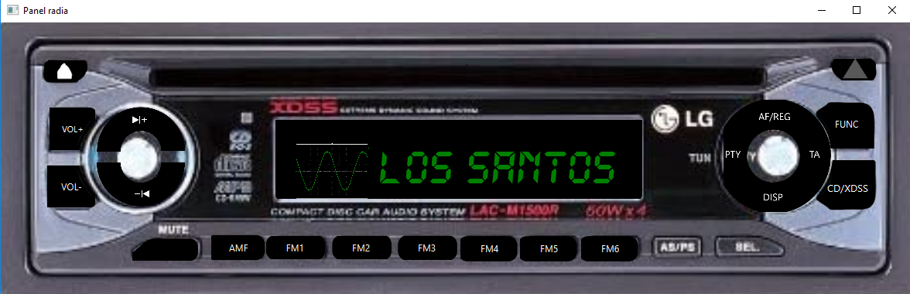
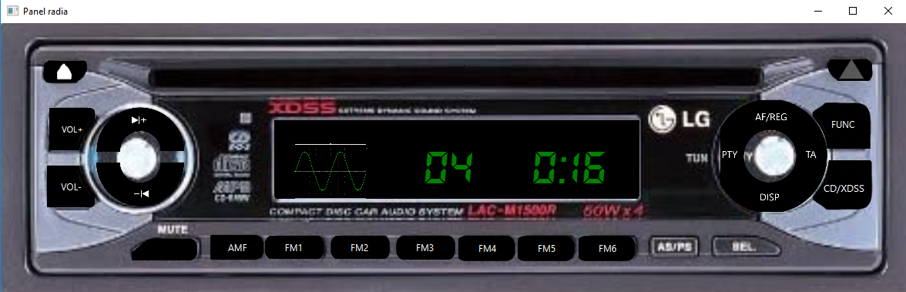

# Car-radio-panel

Application simulating the functions of a car radio.

## Features
* Changing radio frequency
* Playing sounds of sample radio stations
* Saving stations by holding down the buttons
* Playing saved stations
* Changing radio volume
* Mutting and unmuting the radio
* Changing the sound source: radio, CD
* Playing sounds of CD songs

## Preview
* Radio

* CD

